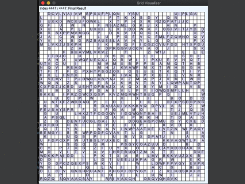

# TopCoder MM108 Visualizer



This is an simple intaractive visualizer for TopCoder Marathon match 108.

https://community.topcoder.com/longcontest/?module=ViewProblemStatement&compid=81903&rd=17415

## Requirements
- SDL2
- C++ compiler

for MacOS Homebrew,
```
$ brew install sdl2 sdl2_image sdl2_ttf
```

## Build
```
$ g++ -std=gnu++11 `sdl2-config --cflags --libs` -lSDL2_ttf SOURCE_CODE_FILE
```

## Usage
```
GridVisualizer visualizer;

for () {
  GridInfo gridInfo;
  // ...
  visualizer.addGridInfo(gridInfo);
}

visualizer.run();
```

- LEFT KEY: next
- RIGHT KEY: go back
- SHIFT KEY + LEFT/RIGHT KEY: skip 10 steps
- A: go first gridinfo
- L: go last gridinfo


